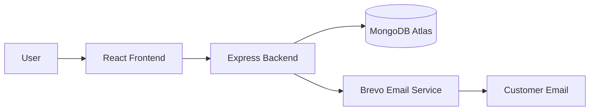
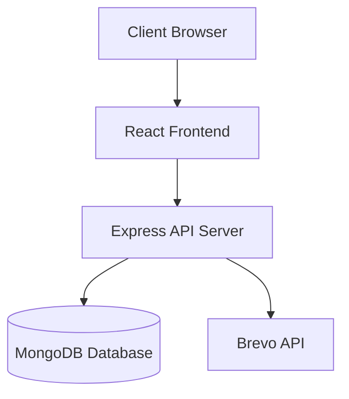
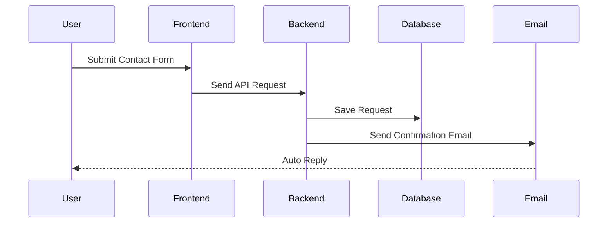

# SLS – Structomech Consultants Website

A modern full-stack website developed for **SLS Structomech Consultants** to establish a strong digital presence and streamline client interactions.

---

## 🚀 Features

- Responsive modern UI
- Service request system
- Contact form integration
- Automatic customer acknowledgment emails
- Admin notifications
- MongoDB database integration
- Secure API handling
- Mobile-friendly design

---

## 🛠️ Tech Stack

### Frontend
- React.js
- Tailwind CSS
- JavaScript
- Axios

### Backend
- Node.js
- Express.js
- MongoDB Atlas
- Mongoose
- Brevo Email API

### Deployment
- Vercel
- Render / Railway

---

## 📁 Project Structure

```text
SLS/
│
├── frontend/
│   ├── src/
│   ├── public/
│   ├── package.json
│   └── .env
│
├── backend/
│   ├── routes/
│   ├── models/
│   ├── controllers/
│   ├── package.json
│   └── .env
│
├── .gitignore
└── README.md
```

---

## 🔄 Application Flow



---

## 🏗️ System Architecture



---

## 📨 Contact Request Workflow



---

## ⚙️ Environment Variables

### Backend (.env)

```env
PORT=3001
MONGODB_URL=your_mongodb_url
SESSION_SECRET=your_secret
ADMIN_PASSWORD=your_password
OWNER_EMAIL=your_email

BREVO_API_KEY=your_api_key
BREVO_SENDER_EMAIL=your_email
```

### Frontend (.env)

```env
VITE_API_URL=http://localhost:3001
```

---

## 🚀 Installation

Clone the repository:

```bash
git clone https://github.com/SATYA-916/SLS.git

cd SLS
```

Install backend dependencies:

```bash
cd backend
npm install
```

Install frontend dependencies:

```bash
cd ../frontend
npm install
```

---

## ▶️ Running the Project

Backend:

```bash
cd backend
npm run dev
```

Frontend:

```bash
cd frontend
npm run dev
```

---

## 🔒 Security

- API keys stored in `.env`
- `.env` files excluded using `.gitignore`
- Sensitive credentials are never committed

---

## 📌 Future Improvements

- Admin dashboard
- Service tracking system
- User authentication
- File uploads
- Analytics dashboard
- Appointment scheduling

---

## 👨‍💻 Developer

**Satya**  
B.Tech CSE  
GITAM University

---

## ⭐ Support

If you found this project useful, please give it a ⭐ on GitHub.
