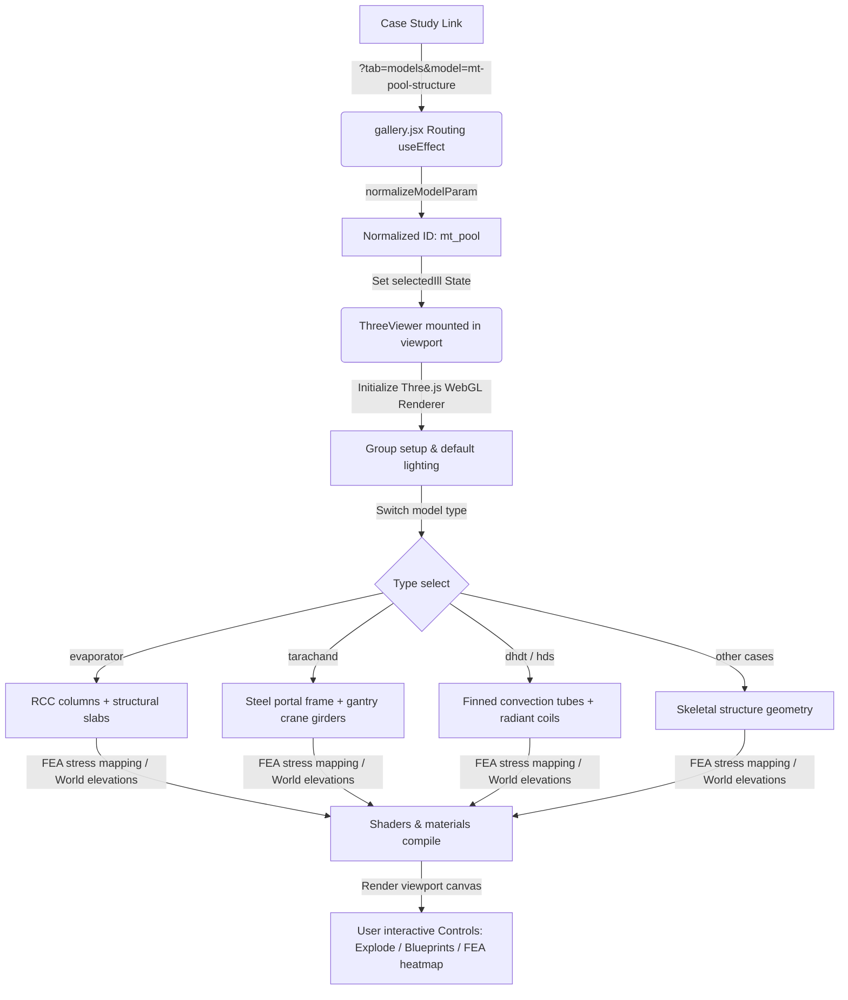
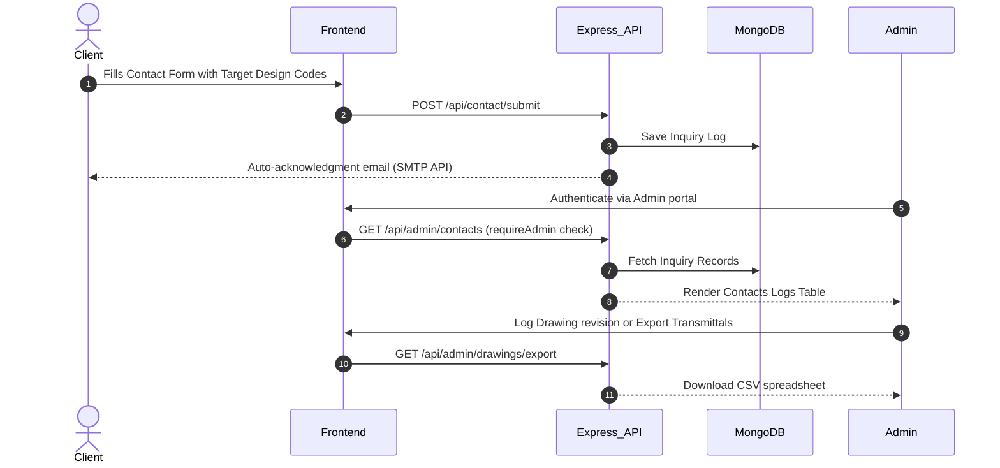

# SLS Consultants Portal

A world-class engineering portal developed for **SLS Consultants** to showcase advanced civil, structural, and mechanical engineering solutions. Featuring interactive WebGL 3D structural models, technical drawings transmittals, and design code directories.

---

## 👤 Developed By

**K. Satya Sampath Kumar** — Full Stack Web Developer Intern, SLS Structo-Mech Consultants (Jul 2026 – Present)

Designed and built end-to-end: frontend (React + Three.js WebGL viewer), backend (Node/Express + MongoDB Atlas), admin dashboard, email integration, and deployment/DNS setup.

- GitHub: [github.com/SATYA-916](https://github.com/SATYA-916)
- LinkedIn: [linkedin.com/in/satya-sampath-93449a28b](https://linkedin.com/in/satya-sampath-93449a28b)

---

## 🚀 Key Features

* **Interactive WebGL 3D Model Engine**: Custom-built Three.js viewer with support for structural explode/assemble animations, real-time lighting, camera settings, and FEA stress heatmap colors mapped recursively using world coordinates.
* **Codes & Design Standards Directory**: Searchable, categorized index of international and regional design standards (ASME Section VIII, API 560, API 530, IS 800, EIL specs) conforming to strict industrial safety clearances.
* **Case Studies & Technical Transmittals**: In-depth case studies for proprietary projects containing scopes, design challenges, custom SVG elevation profiles, and detailed drawing transmittals registers (134+ drawing sheets mapped).
* **Drawing Revision Tracker**: Administrative interface for logging engineering codes, updating revision levels (e.g. Rev 0, Rev 1), managing review status, and exporting transmittals logs as CSV.
* **Secure Admin Dashboard**: Route-level server-side session checks protecting client inquiries logs and internal note tracking.

---

## 🔄 System Architecture & Data Flows

### 1. WebGL 3D Model Render Flow
This diagram illustrates how the `ThreeViewer` components parse routing parameters, initialize 3D assets, and apply custom interactive shaders.


```mermaid
flowchart TD
    A[Case Study Link] -->|"?tab=models&model=mt-pool-structure"| B(gallery.jsx Routing useEffect)
    B -->|normalizeModelParam| C[Normalized ID: mt_pool]
    C -->|Set selectedIll State| D(ThreeViewer mounted in viewport)
    D -->|Initialize Three.js WebGL Renderer| E[Group setup & default lighting]
    E -->|Switch model type| F{Type select}
    F -->|evaporator| G[RCC columns + structural slabs]
    F -->|tarachand| H[Steel portal frame + gantry crane girders]
    F -->|dhdt / hds| I[Finned convection tubes + radiant coils]
    F -->|other cases| J[Skeletal structure geometry]
    G & H & I & J -->|FEA stress mapping / World elevations| K[Shaders & materials compile]
    K -->|Render viewport canvas| L[User interactive Controls: Explode / Blueprints / FEA heatmap]
```

### 2. Inquiry Scoping & Admin Rev Tracker Flow
This sequence chart details the interaction from initial client engineering request to back-office drawing revisions and CSV exports.


```mermaid
sequenceDiagram
    autonumber
    actor Client
    participant Frontend
    participant Express_API
    participant MongoDB
    participant Admin

    Client->>Frontend: Fills Contact Form with Target Design Codes
    Frontend->>Express_API: POST /api/contact/submit
    Express_API->>MongoDB: Save Inquiry Log
    Express_API-->>Client: Auto-acknowledgment email (SMTP API)
    
    Admin->>Frontend: Authenticate via Admin portal
    Frontend->>Express_API: GET /api/admin/contacts (requireAdmin check)
    Express_API->>MongoDB: Fetch Inquiry Records
    Express_API-->>Admin: Render Contacts Logs Table
    
    Admin->>Frontend: Log Drawing revision or Export Transmittals
    Frontend->>Express_API: GET /api/admin/drawings/export
    Express_API-->>Admin: Download CSV spreadsheet
```

---

## 🛠️ Tech Stack

### Frontend
* **React.js** (Vite-powered, dynamic route lazy-loading)
* **Three.js** (WebGL 3D rendering pipeline)
* **Tailwind CSS & Vanilla CSS** (Responsive layouts, premium micro-animations)
* **Wouter** (Lightweight client-side routing switcher)

### Backend
* **Node.js & Express.js** (API routing)
* **MongoDB Atlas** (Contact inquiries database)
* **Brevo Email API** (Auto-acknowledgment and notifications)

---

## 📁 Project Structure

```text
SLS/
├── frontend/
│   ├── src/
│   │   ├── components/      # Common UI parts & WebGL ThreeViewer
│   │   ├── data/            # Local project & services datasets
│   │   ├── pages/           # Page-level components
│   │   ├── App.jsx          # Wouter switch routing
│   │   └── index.css        # Core layout and styling
│   └── package.json
│
├── backend/
│   ├── src/
│   │   ├── routes/          # API endpoints (admin, contacts, projects)
│   │   └── lib/             # Database and email helpers
│   └── package.json
│
├── .gitignore
└── README.md
```

---

## ⚙️ Environment Variables

To run the application locally, define the following variables:

### Backend (`backend/.env`)
```env
PORT=3001
MONGODB_URL=your_mongodb_atlas_connection_string
SESSION_SECRET=your_secure_session_secret
ADMIN_PASSWORD=your_admin_dashboard_password
OWNER_EMAIL=your_inbox_recipient_email

BREVO_API_KEY=your_brevo_smtp_api_key
BREVO_SENDER_EMAIL=your_brevo_verified_sender_email
```

### Frontend (`frontend/.env`)
```env
VITE_API_URL=http://localhost:3001
```

---

## 🚀 Installation & Setup

1. **Clone the repository**:
   ```bash
   git clone https://github.com/SATYA-916/SLS.git
   cd SLS
   ```

2. **Setup Backend**:
   ```bash
   cd backend
   npm install
   npm run dev
   ```

3. **Setup Frontend**:
   ```bash
   cd ../frontend
   npm install
   npm run dev
   ```

---

## 🔒 Security & Performance
* Server-side authentication check via session cookies (`isAdmin`) protects database transactions and drawing logs.
* Assets and page routes are dynamically code-split to optimize Initial Page Load speed. WebGL components load on-demand.
