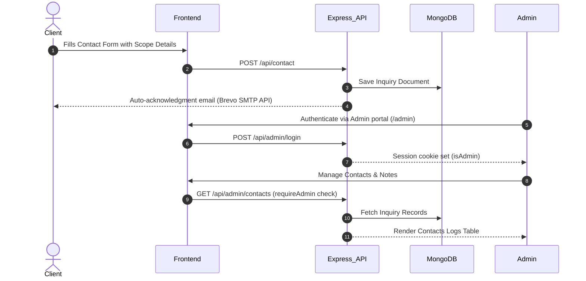

# SLS Structomech Consultants — Engineering Portal

A professional engineering web portal developed for **SLS Structomech Consultants** (Visakhapatnam, India) to showcase civil, structural, and mechanical engineering solutions, project case studies, and technical drawing registers.

---

## 🚀 Key Features

* **Technical Drawing Layouts Gallery**: Categorized register of engineering drawings, GA layouts, elevation profiles, and fabrication details (65+ sheets mapped).
* **Engineering Project Portfolio**: In-depth case studies and portfolio registry for 50+ industrial, refinery, and building projects delivered since 2002.
* **Service Scoping & Consultation Booking**: Integrated contact enquiry forms and Calendly appointment booking for engineering consultation.
* **Secure Admin Dashboard**: Route-level server-side session checks protecting client inquiry logs, status tracking, internal note management, and CSV data export.

---

## 🔄 System Architecture & Data Flows


```mermaid
sequenceDiagram
    autonumber
    actor Client
    participant Frontend
    participant Express_API
    participant MongoDB
    participant Admin

    Client->>Frontend: Fills Contact Form with Scope Details
    Frontend->>Express_API: POST /api/contact
    Express_API->>MongoDB: Save Inquiry Document
    Express_API-->>Client: Auto-acknowledgment email (Brevo SMTP API)
    
    Admin->>Frontend: Authenticate via Admin portal (/admin)
    Frontend->>Express_API: POST /api/admin/login
    Express_API-->>Admin: Session cookie set (isAdmin)
    
    Admin->>Frontend: Manage Contacts & Notes
    Frontend->>Express_API: GET /api/admin/contacts (requireAdmin check)
    Express_API->>MongoDB: Fetch Inquiry Records
    Express_API-->>Admin: Render Contacts Logs Table
```

---

## 🛠️ Tech Stack

### Frontend
* **React.js 18** (Vite-powered, route-based bundle splitting)
* **Tailwind CSS & Vanilla CSS** (Responsive layouts, premium micro-animations)
* **Wouter** (Lightweight client-side routing)
* **TanStack React Query** (Server state management)

### Backend
* **Node.js & Express.js** (API routing)
* **MongoDB Atlas** (Contact inquiries database via Mongoose)
* **Brevo Email API** (Auto-acknowledgment and notifications)

---

## 📁 Project Structure

```text
SLS/
├── frontend/
│   ├── src/
│   │   ├── components/      # Layout, UI components, modals
│   │   ├── data/            # Static datasets and fallbacks
│   │   ├── pages/           # Page-level components
│   │   ├── App.jsx          # Wouter switch routing
│   │   └── index.css        # Core layout and styling
│   └── package.json
│
├── backend/
│   ├── src/
│   │   ├── routes/          # API endpoints (admin, contact, projects, services)
│   │   └── lib/             # Database and email helpers
│   └── package.json
│
├── .gitignore
└── README.md
```

---

## ⚙️ Environment Variables

To run the application locally, define the following variables:

### Backend (`backend/.env`)
```env
PORT=3001
MONGODB_URL=your_mongodb_atlas_connection_string
SESSION_SECRET=your_secure_session_secret
ADMIN_PASSWORD=your_admin_dashboard_password
OWNER_EMAIL=your_inbox_recipient_email

BREVO_API_KEY=your_brevo_smtp_api_key
BREVO_SENDER_EMAIL=your_brevo_verified_sender_email
```

### Frontend (`frontend/.env`)
```env
VITE_API_URL=http://localhost:3001
```

---

## 🚀 Installation & Setup

1. **Clone the repository**:
   ```bash
   git clone <repository_url>
   cd SLS
   ```

2. **Setup Backend**:
   ```bash
   cd backend
   npm install
   npm run dev
   ```

3. **Setup Frontend**:
   ```bash
   cd ../frontend
   npm install
   npm run dev
   ```

---

## 🔒 Security & Performance
* Server-side authentication check via session cookies (`isAdmin`) protects database transactions and inquiry records.
* Assets and page routes are dynamically code-split to optimize initial page load speed.
